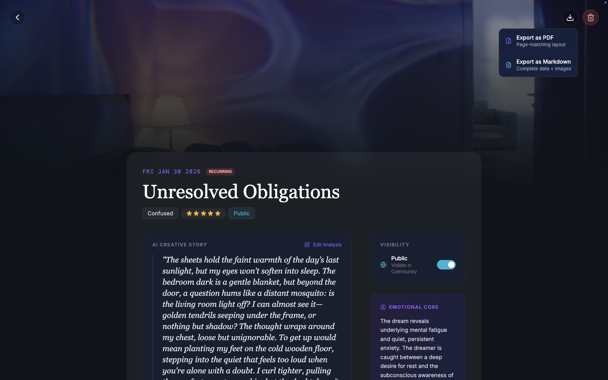
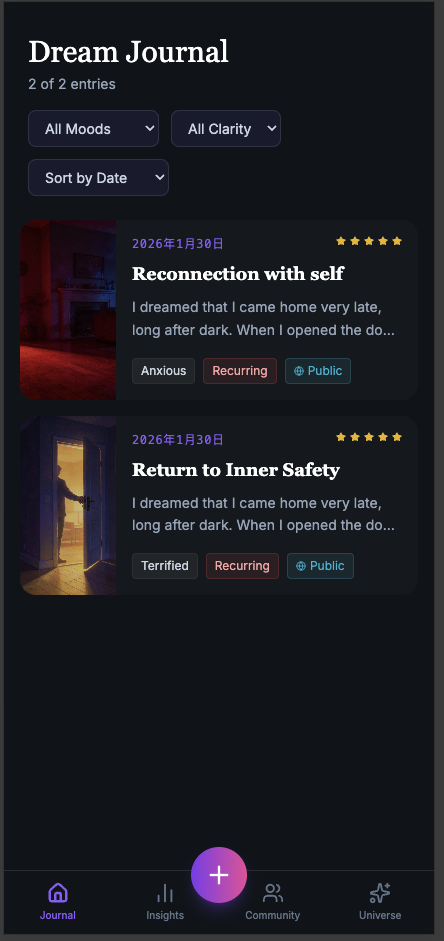
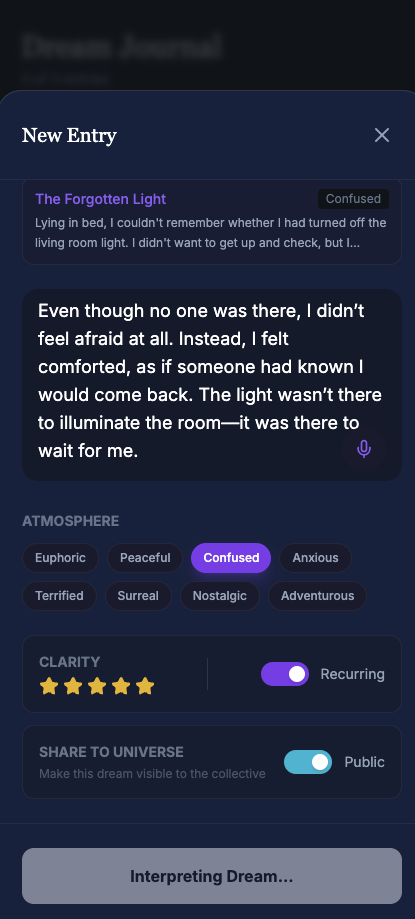
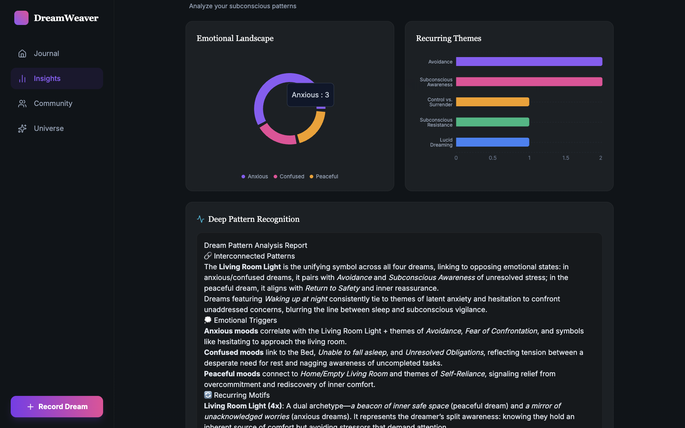
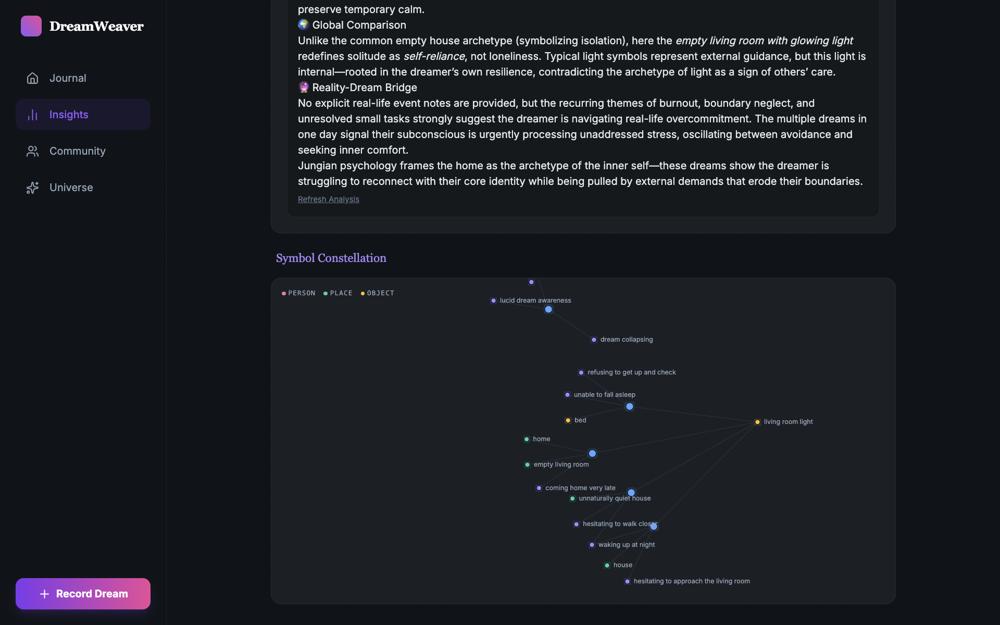
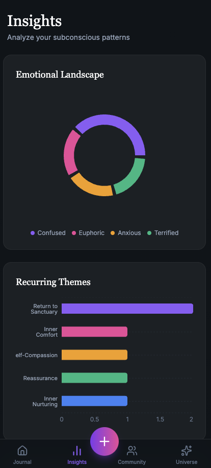
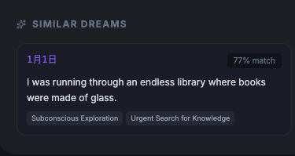
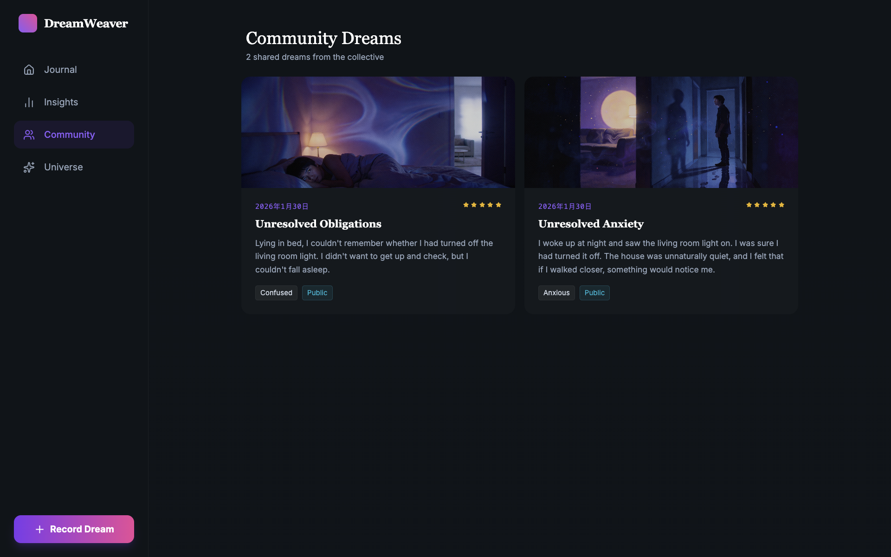
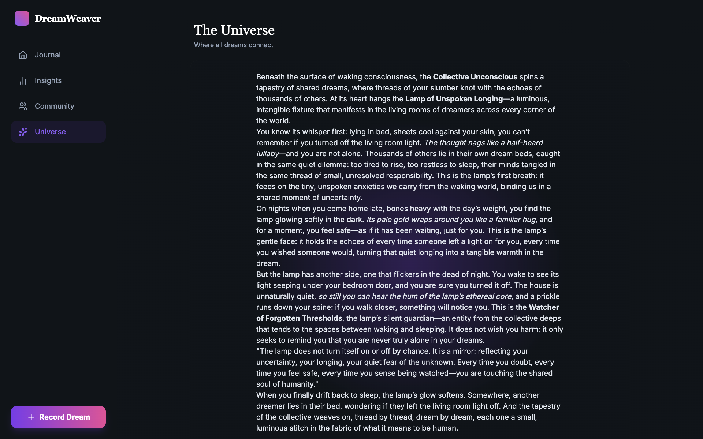
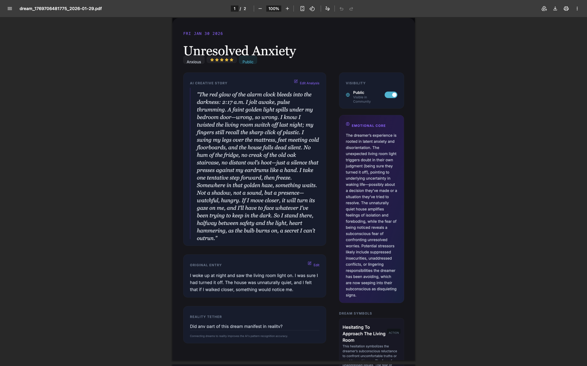

# DreamWeaver 项目介绍

## 项目名称及简介

**DreamWeaver - AI驱动的梦境记录与分析平台**

DreamWeaver 是一个创新的梦境记录与分析平台，利用先进的 AI 技术帮助用户记录、分析和探索梦境世界。通过豆包 AI 的深度学习能力和 Pinecone 向量数据库的语义搜索，DreamWeaver 不仅能够智能分析梦境内容，还能发现梦境之间的隐藏联系，甚至将用户的梦境与全球梦境数据库连接，探索集体潜意识。

[项目仓库](https://github.com/Zymonody7/dreamweaver "项目仓库")|[项目地址](https://dreamweaver-eta.vercel.app)

---

## 团队成员及分工

### 赵奕铭

- 使用 AI Studio 生成初版前端界面
- 通过 Claude Code + Cursor 进行后端开发
- 集成豆包 AI 和 Pinecone 向量数据库
- 实现 CI/CD 自动化部署流程

### 张月

- 打磨前端界面，优化用户体验
- 调研群体记忆（Collective Memory）方案
- 设计梦境可视化图表和交互动画
- 研究心理学理论在产品中的应用

---

## 核心功能介绍及页面截图

### 1. 智能梦境录入 📝

**功能描述：**

- 支持文字输入、语音录入和示例案例
- 实时设置心情、清晰度等元数据

**页面效果：**






---

### 2. AI 梦境分析 🧠

**功能描述：**

- 豆包 AI 自动分析梦境主题和情感
- 识别梦境符号及其心理学含义
- 生成创意性的梦境故事解读

**页面效果：**







---

### 3. 相似梦境发现 🔍

**功能描述：**

- 基于 Pinecone 向量数据库的语义搜索
- 自动发现用户历史中的相似梦境
- 显示相似度评分和匹配主题

**页面效果：**





---

### 4. 梦境数据可视化 📊

**功能描述：**

- 交互式的梦境符号关系图
- 心情趋势和清晰度统计
- AI 深度模式识别报告

**页面效果：**


---

### 5. 集体梦境宇宙 🌐

**功能描述：**

- 将个人梦境与全球公开梦境编织
- AI 生成集体潜意识故事
- 探索人类共同的梦境主题

**页面效果：**



---

### 6. 多格式导出 📥

**功能描述：**

- PDF 导出 - 与页面完全一致的布局
- Markdown 导出 - 包含所有数据和图片
- 一键下载，永久保存

**导出示例：**



---

## AI 工具使用清单

### 1. ChatGPT - 需求整理与头脑风暴 💡

**使用目的：** 项目初期的需求分析和功能设计

**关键 Prompt：**

```
我想开发一个梦境记录应用，帮助用户记录和分析梦境。
请帮我：
1. 整理核心功能需求
2. 设计数据模型
3. 提供技术栈建议
4. 头脑风暴创新功能点

要求：
- 结合心理学理论
- 利用 AI 技术
- 注重用户体验
- 考虑社交属性
```

**输出成果：**

- 完整的功能需求文档
- 数据库表结构设计
- 技术选型建议（Next.js + PostgreSQL + AI）
- 创新功能点（集体梦境、向量搜索等）

---

### 2. AI Studio - 前端界面快速构建 🎨

**使用目的：** 根据需求快速生成初版前端代码

**关键 Prompt：**

```
请帮我创建一个梦境记录应用的前端界面，要求：

技术栈：
- React + TypeScript
- Tailwind CSS
- 深色主题（夜空风格）

页面结构：
1. 导航栏（Journal, Stats, Community, Universe）
2. 梦境卡片列表（显示日期、心情、预览）
3. 录入模态框（文本输入、心情选择、清晰度评分）
4. 详情页（完整内容、AI 分析、符号解读）

设计风格：
- 神秘、梦幻的视觉效果
- 流畅的动画过渡
- 玻璃态（Glassmorphism）设计
```

**输出成果：**

- 完整的 React 组件代码
- Tailwind CSS 样式配置
- 响应式布局实现
- 基础交互逻辑

---

### 3. Claude Code - 后端开发与功能打磨 ⚙️

**使用目的：** 完整的后端 API 开发和前端功能优化

**主要工作：**

**3.1 数据库设计**

```
设计 PostgreSQL 数据库表结构：
- dreams 表（梦境数据）
- users 表（用户信息）
- collective_dreams 表（集体梦境）
- insights 表（AI 分析结果）
```

**3.2 API 路由开发**

```
实现 Next.js API 路由：
- POST /api/dreams - 创建梦境
- GET /api/dreams/similar - 相似梦境搜索
- POST /api/collective-dreams - 集体梦境编织
- POST /api/insights - AI 深度分析
```

**3.3 前端功能优化**

```
优化用户体验：
- 添加三个示例案例
- 添加打字状态指示器
- 优化导出功能（PDF + Markdown）
- 修复 Vercel 部署问题
```

**输出成果：**

- 完整的 API 路由实现
- 数据库初始化脚本
- AI 服务集成代码
- 向量搜索功能
- 前端交互优化
- CI/CD 配置
- 完整的技术文档

---

### 4. ChatGPT - 梦境案例生成 📖

**使用目的：** 生成高质量的示例梦境内容

**关键 Prompt：**

```
请生成 3 个梦境案例，主题围绕"客厅的灯光"，要求：

案例 1：恐怖/悬疑风格
- 心情：Anxious
- 清晰度：4 星
- 包含超自然元素

案例 2：温暖/治愈风格
- 心情：Peaceful
- 清晰度：4 星
- 传达安全感

案例 3：日常/焦虑风格
- 心情：Confused
- 清晰度：3 星
- 反映强迫思维

每个案例：50-80 词，第一人称，英文输出
```

**输出成果：**

```javascript
const dreamCases = [
  {
    title: 'The Mysterious Light',
    content: 'I woke up at night and saw the living room light on...',
    mood: 'Anxious',
    clarity: 4
  },
  {
    title: 'The Waiting Light',
    content: 'I came home very late and saw the living room light on...',
    mood: 'Peaceful',
    clarity: 4
  },
  {
    title: 'The Forgotten Light',
    content: "Lying in bed, I couldn't remember whether...",
    mood: 'Confused',
    clarity: 3
  }
]
```

---

### 5. Cursor - 代码补全与重构 🔧

**使用目的：** 快速编写重复代码和智能重构

**主要功能：**

- 使用 Tab 补全 React 组件结构
- 自动生成 TypeScript 类型定义
- 智能导入依赖包
- 提取重复逻辑为函数
- 实时类型检查和错误修复

**输出成果：**

- 提升开发效率 3-5 倍
- 减少手动输入错误
- 保持代码质量一致性

---

## 技术架构

### 前端

- Next.js 14 + React 18 + TypeScript
- Tailwind CSS + D3.js + Recharts

### 后端

- Next.js API Routes + Node.js
- PostgreSQL + Pinecone
- 豆包 AI (Doubao)

### DevOps

- Vercel + GitHub Actions
- Git + pnpm

---

## 项目亮点

### 技术创新

✅ 向量搜索实现语义相似度匹配
✅ AI 多维度梦境分析
✅ 完整的 CI/CD 流程

### 用户体验

✅ 流畅的交互动画
✅ 直观的数据可视化
✅ 多种录入方式
✅ 隐私保护的社交功能

### AI 应用

✅ 智能主题识别
✅ 符号心理学解读
✅ 情感分析
✅ 创意故事生成

---

**DreamWeaver - 探索梦境，理解自我** 🌙✨
